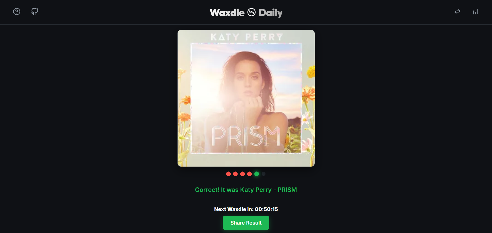

# Web app description:

A visual puzzle daily game where music fans must guess a legendary album cover. Inspired by Wordle.

# User interface:

# Running the project:

[cloudflare pages link here]

Alternatively: Open index.html in your browser of choice.

To fetch new data, create an .env file with LASTFM_API_KEY=your-api-key-here.
Then run "npm install" and "node fetch-albums.js".